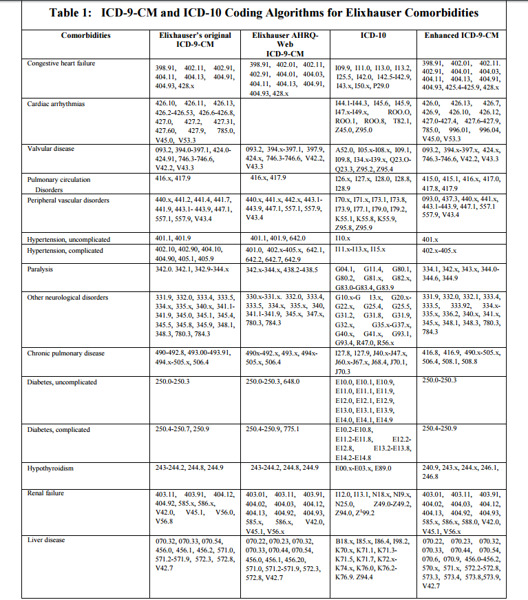
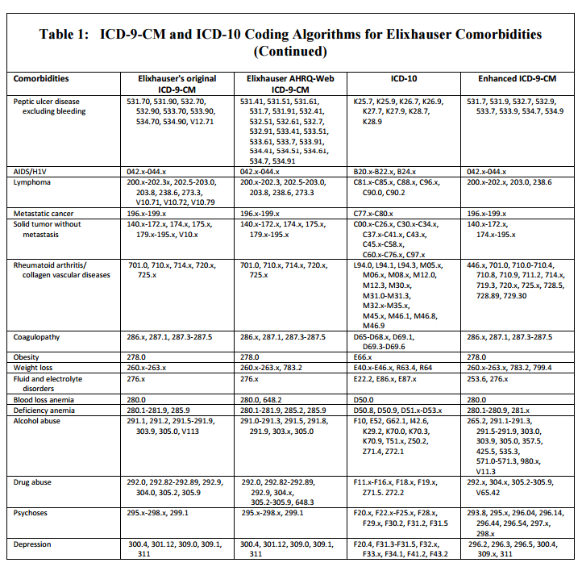

```{r, include=FALSE}
# load libraries
library(icd)
library(shiny)
```

# Comorbidity Map Descriptions
The eight mappings (four for ICD-9-CM and four for ICD-10-CM) which we can use readily are the following:

* Elixhauser ICD-9-CM
* Elixhauser ICD-10-CM
* AHRQ ICD-9-CM
* AHRQ ICD-10-CM
* Quan-Elixhauser ICD-9-CM
* Quan-Elixhauser ICD-10-CM
* Quan-Deyo ICD-9-CM
* Quan-Deyo ICD-10-CM

## Elixhauser and Variants
### Elixhauser ICD-9
The original Elixhauser (ICD-9-CM) comorbidities were described in the following: [Elixhauser et al. 1998](http://www.ncbi.nlm.nih.gov/pubmed/9431328) and contains 31 disease categories.

#### Note
Since the original release of icd-9-CM, there have been annual updates, which are published [here](https://www.cms.gov/Medicare/Coding/ICD9ProviderDiagnosticCodes/codes.html). Therefore, the original Elixhauser mapping may not be entirely appropriate for the current implementation of icd-9-CM. 

### AHRQ ICD-9
In order to keep the Elixhauser comorbidity mappings up to date, the AHRQ published their own version of the original Elixhauser comorbdity mappings, but updated annually and written in SAS. The documentation can be found [here](http://www.hcup-us.ahrq.gov/toolssoftware/comorbidity/comorbidity.jsp).
The disease groupings are exactly the same as the Elixhauser except for the removal of the Arrhythmia grouping, which was done for reliability purposes. ([source](https://www.hcup-us.ahrq.gov/tech_assist/faq.jsp))

### AHRQ ICD-10
The ICD-10-CM version of the AHRQ comorbiditiy mapping (based off of the original Elixhauser mapping) is kept up to date by the AHRQ. The software and documentation for this mapping can be found [here](https://www.hcup-us.ahrq.gov/toolssoftware/ccs10/ccs10.jsp)


### Quan-Elixhauser ICD-9
The Quan-Elixhauser comorbidity mapping was first described in [Quan et al. 2005](http://www.ncbi.nlm.nih.gov/pubmed/16224307). It provided an alternate mapping to the original Elixhauser mappings. However, this has not been updated past the original 2005 version. How much of an impact this has remains to be seen. Supposedly, the Quan-Elixhauser (known as enhanced ICD-9-CM in the Quan et al 2005 paper) algorithm provides better predictive capabilities than the original elixhauser groupings. 

### Elixhauser ICD-10
Quan et al. (2005) translated the original Elixhauser et al. (1998) ICD-9 Comorbidity mapping to ICD-10CM codes. These are listed in the Quan et al. paper as simply ICD-10. 

### Quan-Elixhauser ICD-10
The Quan-Elixhauser enhanced ICD-10-CM comorbidity mapping was a bit harder to track down, but the source code has been made available at the MCHP - University of Manitoba. The logic can be found [here](http://mchp-appserv.cpe.umanitoba.ca/Upload/SAS/ICD10_EX.sas.txt): This seems to have been a part of the same project as the 2005 paper by Quan, but was never explicitly shown in the original paper. 


## Quan-Deyo
The Quan-Deyo comorbidity mappings are based off of the Charlson Comorbidity Index. The original Charlson Comorbidity Index consisted of 19 disease categories, but this was changed to 17 in a subsequent publication by Deyo.

[Charlson et al. 1987](http://www.ncbi.nlm.nih.gov/pubmed/3558716)

[Deyo et al. 1992](http://www.ncbi.nlm.nih.gov/pubmed/1607900)

# Mappings

### Table 1 from Quan et al. 2005
The following table contains comparisons of the following comorbidity mappings:

* Column 1 : Elixhauser ICD-9 (Original)
* Column 2 : AHRQ ICD-9 (in 2005, has been updated several times since then)
* Column 3 : Direct translation of ICD-10 to ICD-9 for column 1 (Elixhauser 1998)
* Column 4 : Quan-Deyo ICD-9 




### Find ICD Codes 
```{r, include = FALSE}
get_codeset <- function(codeset){
       switch(codeset,
              "ICD-9-CM" = "9",
              "ICD-10-CM" = "10")
}

get_mapping <- function(mapping){
  switch(mapping,
         "Elixhauser" = "elix",
         "AHRQ" = "ahrq",
         "Quan-Elixhauser" = "quan_elix",
         "Quan-Deyo" = "quan_deyo")
}

```

```{r, echo=FALSE}
shinyApp(
  ui = inputPanel(
  selectInput("icd_codeset", "ICD Code Set:", choices = c("ICD-9-CM", "ICD-10-CM"), selected = "ICD-9-CM"),
  selectInput("mapping", "Mapping:", choices = c("Elixhauser", "AHRQ", "Quan-Elixhauser", "Quan-Deyo"), selected = "Elixhauser"),
  uiOutput("test"),
  tableOutput("codes")),

  
  server = function(input, output, server){
     codeset <- reactive({input$icd_codeset})
     mapping <- reactive({input$mapping})
     output$test <- renderUI({
       selectInput("Condition", "Condition: ", choices = names(get(paste0("icd",get_codeset(codeset()),"_map_",get_mapping(mapping())))), selected = NULL)
     })
     condition <- reactive({input$Condition})
     output$codes <- renderTable({
       
       temp_table <- icd_explain_table(get(paste0("icd", get_codeset(codeset()), "_map_", get_mapping(mapping())))[[condition()]])
     temp_table <- temp_table[complete.cases(temp_table),]
     temp_table$code <- icd_short_to_decimal(temp_table$code)
     temp_table
     })
     # temp_table <- icd_explain_table(get(paste0("icd", get_codeset(codeset()), "_map_", get_mapping(mapping())))[[condition()]])
     # temp_table <- temp_table[complete.cases(temp_table),]
     # temp_table$code <- icd_short_to_decmical(temp_table$code)
     
   # output$codes <- renderTable({temp_table})

  })

```

## R Package:
The R Package `icd` was written by Jack Wasey:

* Jack O. Wasey (2016). icd: Tools for Working with ICD-9
  and ICD-10 Codes, and Finding Comorbidities. R package
  version 2.0.1.9000. https://github.com/jackwasey/icd